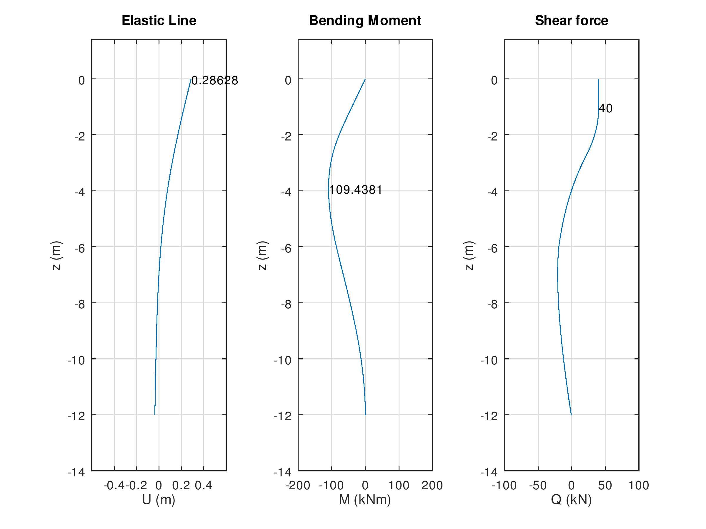

# HPile
## Laterally loaded piles embedded on multilayer soils
_Marcelo M. Rocha, PPGEC/UFRGS_ [(ORCID)](https://orcid.org/0000-0001-5640-1020)

[](https://zenodo.org/badge/latestdoi/144635795)
___

```HPile``` is a Matlab/Octave code for analysing a foundation pile embedded in a multilayer soil.
The pile is assumed to be linear elastic and modeled with beam elements with 2 d.o.f. per node.
The soil is assumed as elastoplastic and modeled as one dimensional springs, one spring each side of each pile node. 
The analysis relies upon an interactive scheme for monotonic conversion.
Soil stiffness is decreased to comply with limit state stresses as soon as elastic limit is overtaken.
Within elastic limit, soil stiffness is regarded as a linear function of depth.
The standard loading is a horizontal force at pile top (first model node), which is gradually applied
from zero to its final value. User must provide final value and number of steps to reach it, only.

Problem to be solved is defined in ```HPile_Pilot``` script, which is the only script that needs to be edited.
The main part of this script is a table containing the soil layer properties. 
Below is the example provided, which is well commented to help users:

```
%===============================================================================
% 1. Pile data
%-------------------------------------------------------------------------------
  hp  =  12;              % Total pile height (m)
  dp  =  0.3;             % lateral pile dimension - diameter (m)
  dz  =  0.1;             % discretization length (m)

  Ep  =  30.;             % Young's modulus for pile material (GPa)
  gp  =  25.;             % Specific weight for pile material (kN/m3)

  gW  =  9.81;            % Specific weight for water (kN/m3)
  zW  =  4.;              % Water table depth from pile top (m)

  Ni  =  50;              % Number of iterations to seek convergence

%===============================================================================
% 2. Geotechnical profile (one row per layer)
%
%    Note 1:  origin of z axis is the pile top, pointing downwards to pile tip.
%             Soil stars at coordinate zS. The free pile top is represented
%             as a virtual empty soil layer, with bottom at zS, which is the
%             first row of matrix "Soil".
%
%    Note 3:  soil horizontal stiffness is modelled as a linear function of
%             depth z, as K = dp*dz*[k0 + k1*(z - zS)]. The spring coefficient
%             "K" has unit [kN/m^3], for it must be multiplied by pile width
%             to give a stiffness per unit length.
%
%-------------------------------------------------------------------------------
%
%    Column 1:  layer bottom position (m).
%    Column 2:  soil specific weight (kN/m3).
%    Column 3:  internal friction angle (degrees).
%    Column 4:  coesion (kN/m2).
%    Column 5:  multiplier for passive limit coefficient kP (*)
%    Column 6:  soil stiffness linear coefficient k0 (kN/m^3).
%    Column 7:  soil stiffness angular coefficient k1 (kN/m^4).
%
%   (*) to account for 3d effects on soil resistance.
%
%-------------------------------------------------------------------------------
%          bottom  gam    phi     c     mk     k0     k1  
%-------------------------------------------------------------------------------
  Soil  = [ 1.00    0.     0.     0.     0.     0.     0.  ;  ... % free top
            6.00   16.    30.     0.     1.   500.     0.  ;  ... % clayey sand
           14.00   18.     0.    20.     1.   300.     0. ];      % sandy clay

%===============================================================================
% 3. Pile load (at pile top: z = 0)
%-------------------------------------------------------------------------------
  HForce = 40.;         % horizontal force at pile top (kN)

%===============================================================================

```

The code will output three formatted figures, with analysis results:

  
  
  

Some final remarks to avoid errors in code execution:

* If soil is specified as too soft, stiffness matrix will be badly conditioned, causing error.
* If convergence does not happens, try to increase the number of iterations to reach final load value.
* An alternative code version for applying controlled displacement instead of force is underway. :relaxed:


